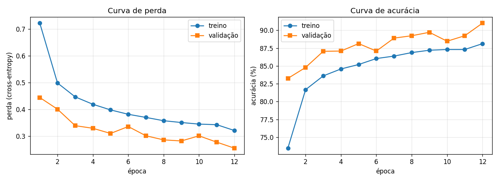
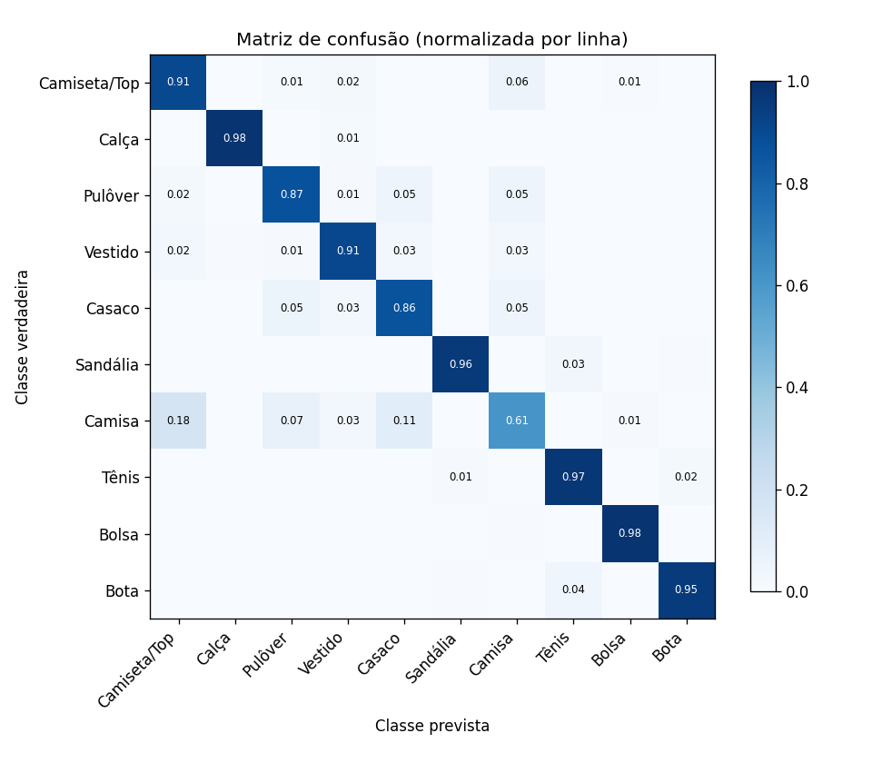

# Classificador de Roupas com CNN: do dado ao deploy

Rede neural convolucional em **PyTorch** que classifica peças de roupa (Fashion-MNIST, 10 classes) com **90,1% de acurácia no teste**, servida como **API REST (FastAPI) em Docker**, com endpoint de lote, métricas de uso e log de predições de baixa confiança.


> Desafio final (Caminho C) da disciplina **Artificial Intelligence e Deep Learning Aplicada** da FIAP.
> Trabalho em dupla, desenvolvido sobre o material do Prof. Dr. Alexandre Miguel de Carvalho ([carvalhoamc/fiap](https://github.com/carvalhoamc/fiap)).

## Resultados

| Métrica | Valor |
|---|---|
| Acurácia de validação (12 épocas, CPU) | 91,00% |
| **Acurácia de teste** | **90,13%** |
| Classe mais difícil | Camisa (F1 = 0,68; revocação 60,6%) |
| Classes mais fáceis | Calça (F1 = 0,99), Bolsa (0,98), Sandália (0,97) |
| Modelo exportado (TorchScript) | 390 KB |
| Teste de integração da API | 20/20 acertos, ~0,8 ms por imagem |
| Imagem Docker | 282 MB comprimida |

<p align="center">
  
  
</p>

## Análise dos erros

- **Confusão concentrada nas peças de parte de cima.** Camisa, camiseta, pulôver e casaco formam um bloco denso na matriz de confusão: 176 camisas do teste foram classificadas como camiseta. Em 28×28 pixels em escala de cinza, essas peças diferem em detalhes (gola, botões) que quase desaparecem.
- **Superconfiança fora do domínio.** Ruído aleatório é classificado como "Bolsa" com 69–81% de confiança, e uma imagem cinza uniforme com 94,6%. A confiança do softmax sozinha não basta para detectar entradas estranhas. Por isso a API registra toda predição abaixo de 50% para revisão.
- **Deslocamento de domínio.** Fotos reais (peça escura em fundo claro) precisam da opção "inverter cores" e ainda assim podem errar, porque o modelo só viu peças claras sobre fundo escuro.

## O que foi construído

**Modelo:** CNN com 3 blocos convolucionais (16 → 32 → 64 filtros) + camada densa de 128 neurônios, dropout, *early stopping* e checkpoint pelo melhor resultado de validação. O conjunto de teste foi usado uma única vez, ao final.

**API** ([`deploy/api.py`](deploy/api.py)). As extensões do Caminho C são autoria da dupla:

| Endpoint | Descrição |
|---|---|
| `GET /` | Página web de teste com upload múltiplo |
| `GET /saude` | Health check, usado pelo `HEALTHCHECK` do Docker |
| `POST /prever` | Classifica uma imagem e retorna classe, confiança e top-3 |
| `POST /prever_lote` | **(extensão)** Classifica até 32 imagens em um único *forward*; arquivos inválidos não derrubam o lote |
| `GET /metricas` | **(extensão)** Requisições por endpoint, total de predições, taxa de baixa confiança e latência média |

**Log de baixa confiança (extensão):** predições com confiança < 0,5 são gravadas em [`logs/baixa_confianca.jsonl`](logs/baixa_confianca.jsonl), insumo para rotulagem manual e retreino.

**Docker (extensão):** imagem enxuta `python:3.12-slim` com PyTorch CPU e health check.

## Como executar

### Opção A: pipeline completo no Google Colab (~25 min)

Abra [`CP1_AI_Deep_Learning_Caminho_C.ipynb`](CP1_AI_Deep_Learning_Caminho_C.ipynb) no [Colab](https://colab.research.google.com) e execute as células em ordem. O notebook clona o repositório da disciplina, treina, avalia, exporta o modelo, sobe a API e testa todos os endpoints. A semente fixa (42) torna o treino reprodutível.

### Opção B: somente a API, com Docker

```bash
git clone https://github.com/cynthiatakematu/fiap-cp01-ai-deep-learning.git
cd fiap-cp01-ai-deep-learning

docker build -t cnn-roupas -f deploy/Dockerfile .
docker run -p 8000:8000 -v "$(pwd)/logs:/app/logs" -e DIR_LOGS=/app/logs cnn-roupas
```

Acesse http://localhost:8000 (página de teste) ou http://localhost:8000/docs (Swagger). Para testar pela linha de comando:

```bash
curl http://localhost:8000/saude
curl -X POST http://localhost:8000/prever_lote \
  -F "arquivos=@amostras/amostra_000_Ankle boot.png" \
  -F "arquivos=@amostras/amostra_001_Pullover.png"
curl http://localhost:8000/metricas
```

> No Windows (PowerShell), use `curl.exe` e `"${PWD}"` no lugar de `"$(pwd)"`.

### Opção C: somente a API, sem Docker

```bash
pip install -r requirements.txt
python -m uvicorn deploy.api:app --port 8000
```

## Estrutura do repositório

```text
├── CP1_AI_Deep_Learning_Caminho_C.ipynb  notebook executado (treino → avaliação → API)
├── deploy/
│   ├── api.py               API FastAPI estendida
│   ├── testar_api.py        teste de integração da disciplina (depende do repositório do professor)
│   └── Dockerfile
├── outputs/
│   ├── modelo_scriptado.pt  modelo TorchScript usado pela API
│   ├── classes.json
│   ├── historico.json       histórico de treino por época
│   ├── metricas_teste.json  métricas por classe no teste
│   └── *.png                curvas, matriz de confusão e erros
├── logs/                    exemplo de log de baixa confiança
└── amostras/                imagens do Fashion-MNIST para testar a API
```

## Créditos

- Material didático, pipeline de treino e API original: Prof. Dr. Alexandre Miguel de Carvalho ([carvalhoamc/fiap](https://github.com/carvalhoamc/fiap)).
- Extensões do Caminho C (lote, métricas, log de baixa confiança e deploy em Docker): **Bruno Tomin** e **Cynthia Takematu**.
- Dataset: [Fashion-MNIST](https://github.com/zalandoresearch/fashion-mnist) (Xiao, Rasul & Vollgraf, 2017).
